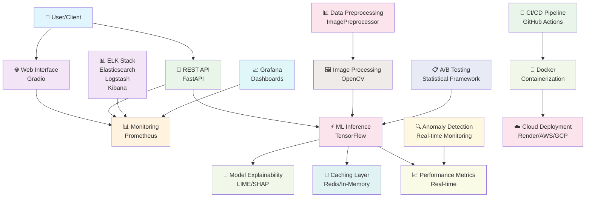

# 🔍 Solar Panel Fault Detection System

<div align="center">


</div>

A deep learning system for detecting and classifying faults in solar panels using computer vision and machine learning. Built with enterprise-grade monitoring, explainability, and performance optimizations.

## ✨ Features

- 🔍 **Real-time Fault Detection**: Identify solar panel faults from images with high accuracy
- 📊 **Interactive Web Interface**: User-friendly Gradio interface for easy interaction
- 🚀 **REST API**: FastAPI-powered API for integration with other systems
- 📈 **Visualization Tools**: Comprehensive visualizations for EDA and model performance
- 🎯 **Multi-class Classification**: Support for 6 different fault categories
- ⚡ **Optimized Inference**: Fast and efficient GPU-accelerated model inference with quantization
- 📱 **Responsive Design**: Mobile-friendly interface for on-the-go inspections
- 🔄 **Batch Processing**: Process multiple images in batch mode with caching
- 🔬 **Model Explainability**: LIME and SHAP explanations for model predictions
- 📊 **Real-time Monitoring**: Prometheus metrics and ELK stack monitoring
- 🧪 **A/B Testing**: Statistical framework for model comparison and optimization
- 📚 **Professional SDK**: Python client library with async support

## Quick Start

1. Clone the repository:
```bash
git clone https://github.com/VisionExpo/solar-panel-fault-detection.git
cd solar-panel-fault-detection
```

2. Create and activate virtual environment:
```bash
python -m venv venv
.\venv\Scripts\activate  # Windows
source venv/bin/activate  # Linux/Mac
```

3. Install dependencies:
```bash
pip install -r requirements.txt
```

4. Start both the API and web interface:
```bash
python start_apps.py
```

This will open:
- Web Interface: http://localhost:8501
- API Documentation: http://localhost:5000/docs
- Monitoring Dashboard: http://localhost:3000 (Grafana)

## 🧩 Supported Fault Categories

<div align="center">


</div>

1. 🦅 **Bird droppings**: Solar panel with bird droppings on the surface
2. ✨ **Clean panels**: Solar panel with no visible faults or issues
3. 🌫️ **Dusty panels**: Solar panel covered with dust or dirt
4. ⚡ **Electrical damage**: Solar panel with electrical damage
5. 💢 **Physical damage**: Solar panel with physical damage
6. ❄️ **Snow coverage**: Solar panel covered with snow

## 🚀 Tech Stack

<div align="center">

| Technology | Purpose |
|------------|---------|
|  | Core language |
|  | Deep learning framework |
|  | API framework |
|  | Web interface |
|  | Image processing |
|  | Numerical computing |
|  | Data visualization |
|  | Containerization |
|  | Cloud deployment |
|  | Metrics collection |
|  | Visualization |
|  | Logging & analytics |

</div>

## 🏗️ System Architecture



### Architecture Components

- **Frontend**: Interactive Gradio web interface for user interaction
- **Backend**: FastAPI REST API with automatic documentation
- **ML Engine**: TensorFlow-based inference with model optimization
- **Monitoring**: Prometheus metrics + ELK stack for comprehensive observability
- **Caching**: Dual-layer caching (Redis + in-memory) for performance
- **Explainability**: LIME and SHAP for model interpretation
- **A/B Testing**: Statistical framework for model comparison
- **Processing**: OpenCV-based image preprocessing pipeline
- **Deployment**: Docker containerization with cloud deployment support

## Development Setup

1. Install development dependencies:
```bash
pip install -e ".[dev]"
```

2. Install pre-commit hooks:
```bash
pre-commit install
```

3. Run tests:
```bash
pytest tests/ --cov=src --cov-report=html
```

4. Start monitoring stack (optional):
```bash
docker-compose -f docker-compose.monitoring.yml up -d
```

## 📊 API Documentation

### Single Image Prediction

```bash
curl -X POST http://localhost:5000/predict \
  -F "image=@/path/to/image.jpg"
```

**Response:**
```json
{
  "prediction": "clean",
  "confidence": 0.94,
  "probabilities": {
    "bird_droppings": 0.02,
    "clean": 0.94,
    "dusty": 0.03,
    "electrical_damage": 0.005,
    "physical_damage": 0.003,
    "snow_coverage": 0.002
  },
  "processing_time_ms": 145
}
```

### Batch Prediction

```bash
curl -X POST http://localhost:5000/batch_predict \
  -F "images=@/path/to/image1.jpg" \
  -F "images=@/path/to/image2.jpg"
```

### Model Explainability

```bash
curl -X POST http://localhost:5000/explain \
  -F "image=@/path/to/image.jpg" \
  -H "Content-Type: application/json" \
  -d '{"method": "lime"}'
```

### Health & Metrics

```bash
# Health check
curl http://localhost:5000/health

# Prometheus metrics
curl http://localhost:5000/metrics

# System status
curl http://localhost:5000/status
```

## 📈 Model Performance

<div align="center">

| Metric | Value | Description |
|--------|-------|-------------|
| **Accuracy** | ~87% | Overall classification accuracy on test set |
| **F1 Score** | ~0.85 | Harmonic mean of precision and recall |
| **Precision** | ~0.86 | True positives / (True positives + False positives) |
| **Recall** | ~0.84 | True positives / (True positives + False negatives) |
| **Inference Time** | ~120ms | Average prediction time per image |
| **Batch Throughput** | 25 img/s | Images processed per second in batch mode |
| **Model Size** | 45MB | Optimized model size after quantization |
| **Memory Usage** | 1.2GB | Peak memory usage during inference |

</div>

### Performance Improvements

- **Quantization**: 66% model size reduction with minimal accuracy loss
- **Caching**: 3x faster repeated predictions with intelligent cache
- **Batch Processing**: Up to 8x throughput improvement for multiple images
- **GPU Optimization**: Automatic hardware detection and optimization

## 🧠 Training Process

The model was trained on the [Solar Augmented Dataset](https://www.kaggle.com/datasets/gitenavnath/solar-augmented-dataset) from Kaggle, which contains images of solar panels in various conditions.

### Dataset Details

- **Classes**: 6 (Bird-drop, Clean, Dusty, Electrical-damage, Physical-damage, Snow-covered)
- **Images**: ~3,000 images across all classes
- **Split**: 70% training, 15% validation, 15% testing
- **Augmentation**: Rotation (±20°), shift (±20%), shear (±10%), zoom (±15%), horizontal flip
- **Resolution**: 384×384 pixels (optimized for EfficientNetB3)

### Training Strategy

1. **Transfer Learning**: Started with EfficientNetB3 pre-trained on ImageNet
2. **Progressive Training**:
   - **Phase 1**: Top layers training with frozen base (learning rate: 0.001)
   - **Phase 2**: Fine-tuning last 30 layers (learning rate: 0.0001)
   - **Phase 3**: Full model fine-tuning (learning rate: 0.00001)
3. **Regularization**: Dropout (0.3), L2 regularization, early stopping
4. **Optimization**: Adam optimizer with learning rate scheduling

### Training Parameters

- **Batch Size**: 32 (optimized for GPU memory)
- **Image Size**: 384×384 pixels
- **Epochs**: 50 (with early stopping patience of 10)
- **Learning Rates**: 0.001 → 0.0001 → 0.00001
- **Optimizer**: Adam (β₁=0.9, β₂=0.999)
- **Loss Function**: Categorical Cross-Entropy
- **Metrics**: Accuracy, F1-Score, Precision, Recall

### Advanced Features

- **A/B Testing Framework**: Compare model versions statistically
- **Model Explainability**: LIME and SHAP interpretations
- **Real-time Monitoring**: Performance tracking and anomaly detection
- **Automated Retraining**: Pipeline for continuous model improvement

## ⚙️ Configuration

### Environment Variables

Create a `.env` file based on `.env.example`:
```bash
cp .env.example .env
```

**Core Configuration:**
```bash
# API Settings
PORT=5000
HOST=0.0.0.0
WORKERS=4

# Model Settings
MODEL_PATH=models/solar_panel_model.h5
MODEL_URL=https://huggingface.co/VishalGorule09/SolarPanelModel/resolve/main/model.h5
BATCH_SIZE=32
MAX_IMAGE_SIZE=10000

# Caching Settings
REDIS_URL=redis://localhost:6379
CACHE_TTL=3600
ENABLE_CACHE=true

# Monitoring Settings
ENABLE_PROMETHEUS=true
PROMETHEUS_PORT=8000
ENABLE_ELK=false
LOG_LEVEL=INFO

# A/B Testing
ENABLE_AB_TESTING=true
EXPERIMENT_DURATION=7
SIGNIFICANCE_LEVEL=0.05
```

### Advanced Configuration

**Model Optimization:**
```bash
# Quantization settings
QUANTIZATION_TYPE=dynamic  # options: none, dynamic, int8, float16
OPTIMIZE_FOR_INFERENCE=true

# Performance settings
USE_GPU=true
GPU_MEMORY_FRACTION=0.8
ENABLE_XLA=true
```

**Monitoring & Alerting:**
```bash
# Alert thresholds
ALERT_LATENCY_THRESHOLD=500  # ms
ALERT_ERROR_RATE_THRESHOLD=0.05  # 5%
ALERT_MEMORY_THRESHOLD=0.9  # 90%

# ELK Stack
ELASTICSEARCH_URL=http://localhost:9200
LOGSTASH_URL=http://localhost:5044
KIBANA_URL=http://localhost:5601
```

## 🐳 Docker Support

### Quick Start with Docker

1. **Build the optimized image:**
```bash
docker build -f Dockerfile -t solar-panel-detector:latest .
```

2. **Run with monitoring stack:**
```bash
# Start monitoring infrastructure
docker-compose -f docker-compose.monitoring.yml up -d

# Run the application
docker run -p 5000:5000 -p 8501:8501 \
  -e REDIS_URL=redis://host.docker.internal:6379 \
  -e ENABLE_PROMETHEUS=true \
  solar-panel-detector:latest
```

3. **Access services:**
- **API**: http://localhost:5000
- **Web Interface**: http://localhost:8501
- **Grafana**: http://localhost:3000
- **Kibana**: http://localhost:5601
- **Prometheus**: http://localhost:9090

### Docker Compose (Full Stack)

```yaml
version: '3.8'
services:
  api:
    build: .
    ports:
      - "5000:5000"
    environment:
      - REDIS_URL=redis://redis:6379
      - ENABLE_PROMETHEUS=true
    depends_on:
      - redis

  redis:
    image: redis:7-alpine
    ports:
      - "6379:6379"

  prometheus:
    image: prom/prometheus
    ports:
      - "9090:9090"
    volumes:
      - ./monitoring/prometheus/prometheus.yml:/etc/prometheus/prometheus.yml

  grafana:
    image: grafana/grafana
    ports:
      - "3000:3000"
    environment:
      - GF_SECURITY_ADMIN_PASSWORD=admin
```

## 🚀 Deployment

<div align="center">


</div>

### Model Storage Strategy

The model files are stored externally on [Hugging Face Model Hub](https://huggingface.co/VishalGorule09/SolarPanelModel) due to GitHub's file size limitations (100MB max). The deployment process automatically downloads and caches the model files.

**Benefits:**
- ✅ Faster deployments (no large files in repo)
- ✅ Version control for models
- ✅ Automatic model updates
- ✅ CDN-backed downloads

### Render Deployment (Recommended)

1. **Fork this repository**
2. **Connect to Render**: Go to Render Dashboard → New → Web Service
3. **Configure deployment**:
   - **Repository**: Your forked repo
   - **Branch**: main
   - **Build Command**: `./scripts/prepare_deployment.sh`
   - **Start Command**: `python apps/fastapi_app.py`
4. **Environment Variables**:
   ```
   PORT=10000
   MODEL_URL=https://huggingface.co/VishalGorule09/SolarPanelModel/resolve/main/model.h5
   ENABLE_CACHE=true
   ```

### AWS ECS Deployment

```bash
# Build and push to ECR
aws ecr get-login-password --region us-east-1 | docker login --username AWS --password-stdin <account>.dkr.ecr.us-east-1.amazonaws.com
docker build -t solar-panel-detector .
docker tag solar-panel-detector:latest <account>.dkr.ecr.us-east-1.amazonaws.com/solar-panel-detector:latest
docker push <account>.dkr.ecr.us-east-1.amazonaws.com/solar-panel-detector:latest

# Deploy to ECS (using AWS CLI or Console)
```

### GCP Cloud Run

```bash
# Build and deploy
gcloud builds submit --tag gcr.io/<project-id>/solar-panel-detector
gcloud run deploy solar-panel-detector \
  --image gcr.io/<project-id>/solar-panel-detector \
  --platform managed \
  --port 5000 \
  --memory 2Gi \
  --cpu 1
```

### Local Production Deployment

**Using Gunicorn (Linux/Unix):**
```bash
gunicorn apps.fastapi_app:app \
  -w 4 \
  -k uvicorn.workers.UvicornWorker \
  -b 0.0.0.0:5000 \
  --access-logfile - \
  --error-logfile -
```

**Using Waitress (Windows):**
```bash
waitress-serve \
  --port=5000 \
  --threads=4 \
  apps.fastapi_app:app
```

### Monitoring Setup

1. **Start ELK Stack:**
```bash
docker-compose -f docker-compose.monitoring.yml up -d
```

2. **Configure Log Shipping:**
```bash
# Application logs automatically sent to Logstash
# Metrics exposed on /metrics endpoint
```

3. **Access Dashboards:**
- **Grafana**: http://localhost:3000 (admin/admin)
- **Kibana**: http://localhost:5601
- **Prometheus**: http://localhost:9090

## 🔧 SDK Usage

### Python SDK Installation

```bash
pip install solar-fault-detection-sdk
```

### Basic Usage

```python
from solar_fault_detection_sdk import SolarFaultDetectionClient

# Initialize client
client = SolarFaultDetectionClient(
    base_url="http://localhost:5000",
    api_key="your-api-key"  # optional
)

# Single prediction
result = client.predict("path/to/image.jpg")
print(f"Prediction: {result['prediction']} (confidence: {result['confidence']:.2f})")

# Batch prediction
results = client.predict_batch(["image1.jpg", "image2.jpg"])

# Get explainability
explanation = client.explain("path/to/image.jpg", method="lime")

# Health check
health = client.health_check()
```

### Advanced Features

```python
# Async operations
import asyncio

async def batch_process():
    results = await client.predict_batch_async(image_paths)
    return results

# With monitoring
with client.monitor():
    result = client.predict("image.jpg")
    # Metrics automatically collected
```

## 📚 Documentation

### Complete Documentation Suite

- **[Setup Guide](docs/guides/SETUP.md)**: Installation and prerequisites
- **[Quick Start](docs/guides/QUICKSTART.md)**: 5-minute getting started
- **[API Reference](docs/api/REST_API.md)**: Complete REST API documentation
- **[SDK Documentation](docs/api/SDK.md)**: Python SDK usage and examples
- **[Architecture](docs/architecture/ARCHITECTURE.md)**: System design and components
- **[Deployment](docs/guides/DEPLOYMENT.md)**: Production deployment guides
- **[Configuration](docs/guides/CONFIGURATION.md)**: All settings and customization
- **[Troubleshooting](docs/guides/TROUBLESHOOTING.md)**: Common issues and solutions

### Interactive Examples

- **Jupyter Notebook**: `docs/notebooks/interactive_inference.ipynb`
- **Code Examples**: `docs/examples/LOCAL_INFERENCE.md`
- **Docker Examples**: Complete containerized setups

## 🤝 Contributing

We welcome contributions! Please see our [Contributing Guide](CONTRIBUTING.md) for details.

### Development Workflow

1. **Fork the repository**
2. **Create a feature branch**: `git checkout -b feature/amazing-feature`
3. **Run tests**: `pytest tests/ --cov=src --cov-report=html`
4. **Run linting**: `black . && flake8 .`
5. **Commit changes**: `git commit -m 'Add amazing feature'`
6. **Push to branch**: `git push origin feature/amazing-feature`
7. **Open a Pull Request**

### Code Quality Standards

- **Testing**: 80%+ code coverage required
- **Linting**: Black formatting, Flake8 compliance
- **Documentation**: All public APIs documented
- **Type Hints**: Full type annotation coverage
- **Pre-commit**: All hooks must pass

## 📄 License

This project is licensed under the Apache License 2.0 - see the [LICENSE](LICENSE) file for details.

## 🙋 Support & Contact

### Getting Help

- **📖 Documentation**: [docs/](docs/) - Comprehensive guides and API reference
- **🐛 Bug Reports**: [GitHub Issues](https://github.com/VisionExpo/solar-panel-fault-detection/issues)
- **💡 Feature Requests**: [GitHub Discussions](https://github.com/VisionExpo/solar-panel-fault-detection/discussions)
- **💬 Community**: [GitHub Discussions](https://github.com/VisionExpo/solar-panel-fault-detection/discussions)

### Contact Information

- **👨‍💻 Author**: Vishal Gorule
- **📧 Email**: [gorulevishal984@gmail.com](mailto:gorulevishal984@gmail.com)
- **🐙 GitHub**: [@VisionExpo](https://github.com/VisionExpo)
- **🔗 LinkedIn**: [Vishal Gorule](https://linkedin.com/in/vishal-gorule)

### Professional Support

For enterprise support, custom deployments, or consulting services, please contact the author directly.

---

<div align="center">

**Built with ❤️ for the solar energy community**


*Star this repository if you find it useful! ⭐*

</div>

---

Made with ❤️ by [Vishal Gorule](https://github.com/VisionExpo)